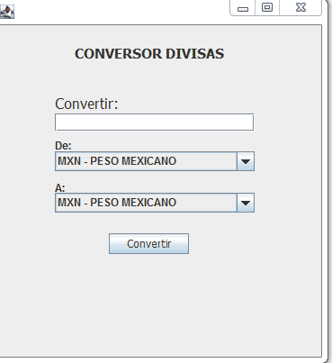

# CONVERSOR DE DIVISAS DE DIFERENTES PAISES

* Utiliza el padron MVC para separar la funciones del conversor:
    * La vista hace la interface grafica con la que interactua el usuario.
    * El modelo que define las divisas y genera un arreglos con todas las divisas que aparecen en la vista y es donde defino la clase Main para lanzar la aplicacion.
    * El controlador que hace de intermediario entre vista y Modelo.

* Utiliza un textbox para introducir la cantidad a convertir.
* Utiliza un Combobox para la divisa Origen y otro para la divisa Destino
* Carga los valores de una tabla obtenida del Banco de Mexico para Febrero-Marzo del 2023
* Cada Divisa esta definida con un codgio de divisa de tres caracteres el nombre de la divisa y su tasa de  cambio respecto al dolar estadounidense.
* se hace un arreglo de todas las divisas que se van a manejar y se cargan a los combobox.
* Utiliza un boton de conversion, cuando el textbox tiene un numero de punto decimal valido hace la conversion.
* Tambien cuando se cambian las opciones del combobox automaticamente calcula la conversion si es que hay un numero valido en el textbox.
* El resultado de la conversion se pone un un Label de resultado y contiene la cantidad que se pidio convertir junto con sl codigo de la divisa origen y su equivalente a la divisa destino tambien con su codigo correspondiente.

Este es el demo de la aplicacion:

